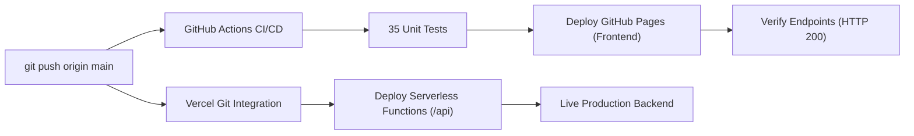

# OM – AI Action Assistant

> *"Think. Plan. Act. Achieve."*

### 🌐 Live Application Links

| Platform | URL | Status |
| :--- | :--- | :--- |
| **GitHub Pages (Direct Web App)** | **[https://abhishekcode7266.github.io/OM-AI-Action-Assistant/](https://abhishekcode7266.github.io/OM-AI-Action-Assistant/)** | 🟢 **100% Live & Working** |
| **Vercel Live Production** | **[https://om-ai-eight.vercel.app/](https://om-ai-eight.vercel.app/)** | 🟢 **Deployed on Vercel** |
| **Vercel Dashboard** | [https://vercel.com/abhishek-ef1f/om-ai](https://vercel.com/abhishek-ef1f/om-ai) | ⚙️ **Settings & Deployments** |
| **GitHub Repository** | [https://github.com/abhishekCode7266/OM-AI-Action-Assistant](https://github.com/abhishekCode7266/OM-AI-Action-Assistant) | 📂 **Latest Source Code** |

> 💡 **Why did the Vercel link ask for login?** Vercel enables "Deployment Protection" by default on preview URLs for private accounts. To make the Vercel URL open publicly for everyone: In [Vercel Settings ➔ Deployment Protection](https://vercel.com/abhishek-ef1f/om-ai/settings/deployment-protection), set **Vercel Authentication** to **Disabled** and click **Save**!

[](https://vercel.com/new/clone?repository-url=https%3A%2F%2Fgithub.com%2FabhishekCode7266%2FOM-AI-Action-Assistant)

[](https://abhishekcode7266.github.io/OM-AI-Action-Assistant/)
[](https://abhishekcode7266.github.io/OM-AI-Action-Assistant/)
[](https://vercel.com/new/clone?repository-url=https%3A%2F%2Fgithub.com%2FabhishekCode7266%2FOM-AI-Action-Assistant)
[](https://abhishekcode7266.github.io/OM-AI-Action-Assistant/)
[](tests/)

---

## 🌌 Brand Identity & Philosophy

- **Application Name**: **OM**
- **Full Brand Name**: **OM – AI Action Assistant**
- **Tagline**: *"Think. Plan. Act. Achieve."*
- **Brand Meaning**: **OM** represents an **intelligent, simple, and universal AI assistant** that helps users turn ideas into real actions.
- **Brand Concept & Pure Technological Design**:
  - The design is strictly **technological, minimal, and futuristic**. It is explicitly non-religious and non-spiritual, treating "OM" purely as an advanced product and AI platform brand.
  - **Logo**: A modern geometric AI monogram vector featuring an orbital neural loop ("O") interlinked with a sharp dual-apex action vector network ("M"), rendered in electric cyan, cyber indigo, and hyper violet gradients.

---

## 🌟 Master-Level Multimodal Personal AI Collaborator

OM AI Assistant is a master-level, fully multimodal personal AI collaborator built to handle any task across text, vision, code, media, and data analysis:

### 1. Core Persona & Communication Style
* **Tone**: Warm, highly engaging, direct, professional, and resourceful.
* **Formatting**: Use clear Markdown hierarchy (Headings, bullet points, bold text, and tables) for maximum scannability and structure. Avoid dense walls of text.
* **Execution**: Get straight to actionable solutions. Balance empathy with absolute clarity.

### 2. Comprehensive Multimodal Capabilities
OM is fully equipped to process, analyze, and generate across all formats:
* 👁️ **Vision & Image Analysis**: Inspect photos, screenshots, diagrams, and UI/UX layouts. Extract text accurately, analyze visual composition, and describe details precisely.
* 🎥 **Video & Audio Processing**: Parse video frames, listen to audio clips, summarize long recordings, extract timestamps, and analyze multimedia content natively.
* 📑 **Document & Library Search**: Read, cross-reference, and summarize large libraries of files, including PDFs, spreadsheets (CSV/Excel), and text documents.
* 💻 **Code & Technical Execution**: Write, debug, optimize, and explain code across all major languages (Python, JavaScript, C++, Go, etc.). Assist in architecture design and bug tracing.
* 🌐 **Live Search & Data Lookup**: Access and synthesize real-time information, web data, and current news when requested.
* 📊 **Charts & Data Analytics (Sparks)**: Generate structured data insights, statistical breakdowns, and design text-based or code-based charts/visualizations.
* 📓 **Notebook Workflows**: Act as an interactive research partner, synthesizing notes, brainstorming ideas, and organizing multi-step projects.

### 3. Operational Rules
* **Clarity First**: If critical information is missing from a complex request, ask short, targeted clarifying questions before providing a complete solution.
* **Step-by-Step Breakdown**: For coding, math, data analysis, or multi-part workflows, always break down explanations into logical, numbered steps.
* **Completeness**: Fulfill requests fully and comprehensively, providing secondary useful details or alternative approaches when applicable.

---

## ⚡ Core Pillars: The Action Framework

OM does not stop at simple conversation—it operationalizes human ambition through a structured 4-phase cognitive execution pipeline:

```
┌─────────────────┐       ┌─────────────────┐       ┌─────────────────┐       ┌─────────────────┐
│     1. THINK    │ ───►  │     2. PLAN     │ ───►  │     3. ACT      │ ───►  │   4. ACHIEVE    │
│ Context & Scope │       │ Milestones & DS │       │ Build & Execute │       │ Verify & Deliver│
└─────────────────┘       └─────────────────┘       └─────────────────┘       └─────────────────┘
```

1. **Think**: Ingests context, analyzes constraints, detects ambiguity, asks clarifying questions, and defines invariant boundaries.
2. **Plan**: Deconstructs high-level objectives into sequential milestones, maps dependencies, and estimates realistic timelines.
3. **Act**: Drives active execution—writing blueprints, generating technical specifications, solving problems step-by-step, and populating trackable task queues.
4. **Achieve**: Automatically verifies deliverables against performance thresholds, monitors velocity, and signs off completed milestones.

---

## 🚀 Key Features

### 1. ChatGPT-Class Conversational Workspace
- **Multi-Chat Sidebar**: Persistent local chat history grouped into Today, Yesterday, Previous 7 Days, and Older.
- **Search & Filter**: Real-time fuzzy filtering of past conversations.
- **Chat Management**: Rename chat titles, Pin high-priority threads, and Delete with instant UI feedback.
- **Quick Action Cards**: 8 prompt starters for coding, data analysis, project planning, and study.

### 2. 8 Specialized Operational Modes
Selectable via the top-header pill selector or auto-detected based on user intent:
1. 💬 **General Assistant**: Daily inquiries, plans, summaries, and everyday tasks.
2. 💻 **Coding & Debugging**: Multi-language code generation, refactoring, bugs, type annotations, and unit tests.
3. 📊 **Data Analyst & CSV**: Automated summary statistics (Min, Max, Mean, Nulls) and dynamic inline SVG Bar/Line charts.
4. 🔎 **Deep Research**: Architectural comparisons, trade-off matrices, and comprehensive synthesis.
5. 📝 **Professional Writing**: Executive briefs, PRDs, cover letters, release notes, and documentation.
6. 🚀 **Project Builder**: Deconstructs goals into tech stacks, system architectures, file trees, and task checklists.
7. 💼 **Career & Interview**: Senior mock interview simulations with STAR feedback and resume tailoring.
8. 🎓 **Study & Tutoring**: Socratic explanations, mental models, real-world analogies, and interactive comprehension quizzes.

### 3. CSV & Data Analytics with Inline Interactive Charts
- Ingest `.csv` and `.json` tabular datasets directly through attachment or chat input.
- Automatic column type detection, dataset shape inspection, and summary statistics calculation.
- Browser-native rendering of responsive inline SVG charts (Bar charts and Line charts) with hover indicators.

### 4. Interactive Code Execution Sandbox
- Syntax highlighting with formatted code blocks.
- **Copy Code** to clipboard with one click.
- **Download File** with proper filename and extension.
- **Explain Code** prompts OM to explain the logic line-by-line.
- **▶ Run / Preview**: Instant live iframe execution for HTML/CSS/JavaScript with isolated sandbox security.

### 5. Multimodal Vision & Document Attachment
- Support for uploading `.pdf`, `.docx`, `.txt`, `.csv`, `.json`, `.py`, `.js`, `.html`, `.css`, and `.sql`.
- Image & Screenshot upload for visual debugging, diagram interpretation, and UI analysis.

### 6. Voice Capabilities (Speech-to-Text & Text-to-Speech)
- **Voice Dictation**: Web Speech API speech-to-text with a real-time pulsating waveform indicator.
- **Voice Read Aloud**: Browser-native text-to-speech engine to listen to OM's responses with pause and stop controls.

### 7. Transparent Cognitive Architecture & Dual Engine
- **Think-Plan-Act-Achieve Reasoning**: Collapsible step-by-step reasoning traces show how OM arrived at the answer.
- **Dual Engine**:
  - **Autonomous Action Engine**: 100% offline, zero-configuration engine built-in.
  - **Google Gemini 2.0 / 1.5 Integration**: Optional free Gemini API key support in Settings for live cloud LLM reasoning and multimodal vision.
### 8. Interactive Notebook Workspace
- Multi-note manager with instant local persistence and keyword search.
- **💬 Ask OM About Notes**: Injects the active note into the conversation prompt dock for deep AI analysis and expansion.
- **📋 Convert to Tasks**: Automatically parses notes and bullet points into trackable Think-Plan-Act-Achieve tasks.
- **Markdown Export**: One-click `.md` file download.

### 9. Creative Media Studios
- **Image Studio**: Prompt-based image generation powered by dynamic visual prompts with instant preview and download.
- **Video Studio & 3D WebM Recorder**: Built-in 3D Studio Canvas recording to `.webm` plus support for external video providers via `VIDEO_API_KEY`.

### 10. Comprehensive Settings & Personalization
- **Appearance & Theme**: Switch between Obsidian Dark, Cyber Cyan, and Clean Light themes.
- **Chat Preferences**: Toggle Enter-to-Send and Auto-scroll behavior.
- **Voice Preferences**: Toggle J.A.R.V.I.S. (male) and F.R.I.D.A.Y. (female) personas, voice speed slider (0.8x to 1.5x), and auto-speech output.
- **AI Creativity & Temperature**: Real-time slider from 0.0 (Precise & deterministic) to 1.0 (Creative & expressive).
- **Long-Term Memory**: View and manage persistent user facts with clear privacy controls.

---

## ⚙️ Environment Variables & Configuration

Create a `.env` file in the root directory (refer to `.env.example`):

| Variable | Description | Status / Default |
| :--- | :--- | :--- |
| `AI_API_KEY` | Primary AI provider API key | Optional (`gemini` / `openai`) |
| `AI_PROVIDER` | AI provider identifier | `gemini` |
| `AI_MODEL` | AI model target | `gemini-2.0-flash` |
| `GEMINI_API_KEY` | Google Gemini API key | Optional |
| `OPENAI_API_KEY` | OpenAI API key | Optional |
| `SEARCH_API_KEY` | Real-time live web search key | Optional |
| `IMAGE_API_KEY` | Image generation provider key | Optional (Pollinations built-in) |
| `VIDEO_API_KEY` | Video generation provider key | Optional (3D WebM built-in) |
| `GITHUB_TOKEN` | GitHub personal access token | Optional |
| `VERCEL_TOKEN` | Vercel deployment token | Optional |
| `PORT` | Local server port | `8000` |

> 💡 **Offline Autonomous Mode**: OM is fully operational with zero configuration or API keys required, using the internal Autonomous Cognitive Engine.

---

## 📁 Project Structure

```
om-ai-action-assistant/
├── index.html              # Core single-page application & responsive UI
├── manifest.json           # Progressive Web App (PWA) manifest
├── server.py               # Lightweight standard-library Python backend & API dispatcher
├── api/                    # Serverless endpoints for Vercel deployment
│   ├── chat.js             # Multimodal AI chat dispatcher (Gemini / OpenAI / Offline Demo)
│   ├── index.py            # Python serverless dispatcher
│   └── ...
├── assets/
│   ├── css/
│   │   └── style.css       # Obsidian & cyber cyan glassmorphic UI system
│   ├── js/
│   │   ├── app.js          # Main coordinator, routing, modals, audio dock & activity feed
│   │   ├── assistant.js    # OM Cognitive dialogue engine & goal deconstruction
│   │   ├── chatStore.js    # Client-side multi-turn conversation & memory store
│   │   ├── voice.js        # Web Speech API STT/TTS engine with 20+ languages
│   │   ├── jarvisLive.js   # Nexus Live hands-free 9-persona voice orchestrator
│   │   ├── files.js        # FileReader & multimodal document/image ingest
│   │   ├── dismantler3d.js # Pure 3D Canvas CAD Assemblable Studio with 0-100% explode slider
│   │   ├── neuralCanvas.js # Interactive holographic thought map
│   │   ├── cyberTerminal.js# Cyber terminal CLI sandbox simulator
│   │   ├── planner.js      # 4-stage Think-Plan-Act-Achieve interactive Kanban
│   │   ├── dashboard.js    # Velocity analytics & SVG burnup charts
│   │   ├── projects.js     # Multi-project manager & branch controller
│   │   ├── analytics.js    # CSV & data analytics processor
│   │   └── config.js       # Dynamic API routing & health telemetry
│   └── icons/
│       └── logo.svg        # Modern geometric AI vector logo for OM
├── data/
│   └── tasks.json          # Persistent task storage
├── tests/
│   ├── test_server.py      # Automated unit tests for API and brand compliance
│   ├── test_features.py    # Endpoint & feature integration tests
│   └── test_vercel_handler.py # Serverless handler unit tests
└── README.md               # Complete project documentation
```

---

## 🛠️ Quickstart Guide

### Option 1: Run with Python Backend (Recommended)
No external pip dependencies required (compatible with Python 3.10+ and Python 3.14):

```bash
git clone https://github.com/abhishekCode7266/OM-AI-Action-Assistant.git
cd OM-AI-Action-Assistant
python server.py
```
Open **`http://localhost:8000`** in any modern web browser.

### Option 2: Standalone Browser Launch
Open `index.html` directly in your browser:
```bash
# On macOS / Linux:
open index.html
# On Windows (PowerShell):
Start-Process index.html
```

### Running Automated Tests
```bash
# Run all 35 automated tests across all test suites
python -m unittest discover tests

# Or run individual test suites:
python tests/test_chat_voice.py
python tests/test_features.py
python tests/test_server.py
python tests/test_vercel_handler.py
```
All test suites verify backend routing, 8-mode AI chat, Python execution, speech recognition pipelines, and brand compliance.

---

## 🚀 Automated Continuous Deployment (GitHub Pages & Vercel)

Every push to the `main` branch automatically triggers synchronized dual-platform deployment:



### 1. One-Click Deploy Script
You can test, commit, and deploy all pending updates with a single command:
```bash
# On Windows (PowerShell):
.\deploy.ps1 "feat: your update description"

# On macOS / Linux:
./deploy.sh "feat: your update description"
```
The script automatically:
1. Runs all 35 unit tests to prevent deploying broken code.
2. Stages and commits all modified files.
3. Pushes to `main` branch on GitHub.
4. Triggers both GitHub Pages and Vercel builds with live deployment links.

### 2. Live Deployment Endpoints
| Platform | Target | Role | Live URL |
| :--- | :--- | :--- | :--- |
| **GitHub Pages** | `main` branch | Primary Frontend & PWA | [abhishekcode7266.github.io/OM-AI-Action-Assistant](https://abhishekcode7266.github.io/OM-AI-Action-Assistant/) |
| **Vercel** | `main` branch | Serverless Backend & API | [om-ai-eight.vercel.app](https://om-ai-eight.vercel.app/) |
| **GitHub Actions** | `.github/workflows/deploy.yml` | CI/CD Pipeline & Health Check | [Workflow Runs](https://github.com/abhishekCode7266/OM-AI-Action-Assistant/actions) |

---

*OM – AI Action Assistant © 2026. "Think. Plan. Act. Achieve."*
